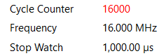
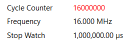
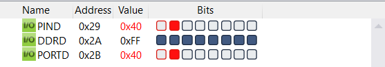
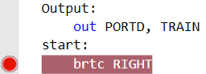

---
#{{{
# vim: set conceallevel=0:
title: 'Ανάπτυξη κώδικα για το μικροελεγκτή ATmega328 και προσομοίωση της 
        εκτέλεσης του στο αναπτυξιακό περιβάλλον MPLAB X'
subtitle: 'Εργαστήριο Μικροϋπολογιστών'
author:
- Κριθαρίδης Κωνσταντίνος, $el21045$
- Μπαλάτος Δημήτριος, $el21170$
date: '15 Οκτωβρίου 2024'
subject: ''
keywords: ''
abstract: ''
lang: el_GR
linkcolor: blue
fontsize: 12pt
mainfont: 'CMU Serif'
sansfont: 'CMU Sans Serif:style=BoldItalic'
monofont: 'CMU Typewriter Text:style=LightOblique'
documentclass: article
classoption: ''
toc: false
papersize: a4
geometry:
- margin=1.5cm
urlcolor: blue
toccolor: black
links-as-notes: false
numbersections: true
#}}}
---

# Ρυθμιζόμενες χρονικές καθυστερήσεις
Ορίζουμε εντολή `wait_approx_1_msec` που κάνει την πλειοψηφία των απαραίτητων κύκλων (15980 από 16000) για καθυστέρηση $1$ msec μέσω απλού loop από το 3991 προς τα κάτω. Για να κάνουμε τους υπόλοιπους 20 κύκλους ανά ms, πρέπει να διακρίνουμε περιπτώσεις ανάλογα αν διανύουμε το τελευταίο δευτερόλεπτο, ώστε να αντιμετωπίσουμε τον επιπλέον απαραίτητο χρόνο της εξωτερικής `rcall`, της `ret` και του υπόλοιπου σταθερού overhead ($3 + 4 + 1 + 1 = 9$ κύκλοι). Για να το κάνουμε αυτό, αξιοποιούμε 9 `brne`, τα οποία εκτελούν 2 κύκλους σε κάθε επανάληψη, ενώ 1 στη τελευταία, οπότε μας επιτρέπουν να "αφαιρούμε" το σταθερό overhead μέσω της τελευταίας επανάληψης. Συνεπώς, σε κάθε επανάληψη γίνονται $2 + 9*2 = 20$ κύκλοι που προστίθενται στους $15980$ για να αθροίσουν στους $16000$, ενώ το σταθερό overhead λόγω των brne γίνεται $9 - 9 = 0$, επιτυγχάνοντας τέλεια ακρίβεια. Ο κώδικας δουλεύει για κάθε τιμή του Delay_ms $\geq 1$ που χωράει σε 2 bytes, δηλαδή από 1 έως 65535.  

Βλέπουμε χρόνο εκτέλεσης μέσω της προσομοίωσης για $1$ msec και $1$ sec αντίστοιχα:





```asm {source=Ex1_1/Ex1/main.asm}
```

\vskip1in

# Υπολογισμός λογικών συναρτήσεων
Η υλοποίηση είναι straight-forward μετάφραση των λογικών συναρτήσεων σε κώδικα. Αρχικά υπολογίζουμε τα συμπληρωματικά των μεταβλητών, μετά υπολογίζουμε τις συναρτήσεις. Για τα ενδιάμεσα αποτελέσματα σε κάθε περίπτωση αξιοποιούμε τον καταχωρητή του αποτελέσματος και έναν βοηθητικό καταχωρητή `tmp`.

Πίνακας:

  A       B      C      D     FO       F1 
------ ------ ------ ------ ------- -------
 0x51   0x41   0x21   0x01   0xEF    0xDF 
 0x52   0x43   0x24   0x05   0xEB    0xDB 
 0x53   0x45   0x27   0x09   0xE5    0xD3 
 0x54   0x47   0x2A   0x0D   0xE7    0xD5 
 0x55   0x49   0x2D   0x11   0xEB    0xC7 
 0x56   0x4Β   0x30   0x15   0xEB    0xCB 

```asm {source=Ex1_2/Ex2/main.asm}
```

\vskip1in

# Αυτοματισμός βαγονέτου
Για την καθυστέρηση αξιοποιήθηκε η μέθοδος που ορίστηκε στην *Άσκηση 1*. Μετά, εναλλάξ τρέχουμε τις υπορουτίνες `RIGHT` -- `LEFT`, που επιλέγονται βάσει της σημαίας `Τ`.

Οι `RIGHT` -- `LEFT` με την σειρά τους καλούν το `delay`, ενημερώνουν τον καταχωρητή `TRAIN` και, στο label `OUTPUT`, τον εκτυπώνουν στα LEDs του PORTD πριν επιστρέψουν στην `start` για την επόμενη επανάληψη. Υπεύθυνη για την επιλογή μεταξύ των 2 είναι η `start`.

Για την ενημέρωση της `T`, ελέγχουμε αν το 1 hi-bit του καταχωρητή `TRAIN` αφαιρέθηκε και πήγε στο Carry λόγω των shifts που γίνονται. Όταν αυτό γίνεται, επαναφέρουμε τον καταχωρητή στην προηγούμενη τιμή (κάνουμε έτσι 2 καθυστερήσεις σε κάθε άκρο) και ενημερώνουμε το `T` πριν πάμε στην `OUTPUT`.






```asm {source=Ex1_3/Ex3/main.asm}
```
