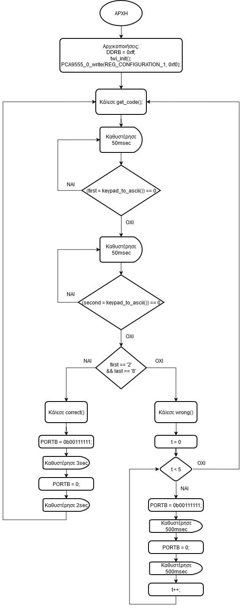

---
#{{{
# vim: set conceallevel=0:
title: 'Χρήση πληκτρολογίου 4×4 σε θύρα επέκτασης στον AVR'
subtitle: 'Εργαστήριο Μικροϋπολογιστών'
author:
- Κριθαρίδης Κωνσταντίνος, $el21045$
- Μπαλάτος Δημήτριος, $el21170$
date: '26 Νοεμβρίου 2024'
subject: ''
keywords: ''
abstract: ''
lang: el_GR
linkcolor: blue
fontsize: 12pt
#fontfamily: 'GFS Artemisia'
mainfont: 'CMU Serif'
sansfont: 'CMU Sans Serif:style=BoldItalic'
monofont: 'CMU Typewriter Text:style=LightOblique'
documentclass: article
classoption: ''
toc: false
papersize: a4
geometry:
- margin=1.5cm
urlcolor: blue
toccolor: black
links-as-notes: false
numbersections: true
#}}}
---

# Ζήτημα 6.1
Αρχικά, μεταφέρουμε τον κώδικα για χρήση του `Port Expander`. Θέτουμε τα bits $0 
\dots 3$ του `EXT_PORT1` (συνδεδεμένα στο PIND) ως έξοδο και τα $4 \dots 7$ ως 
είσοδο για να μπορούμε να καταλαβαίνουμε ποιά κουμπιά πατήθηκαν στο 
πληκτρολόγιο. Δημιουργούμε συνάρτηση `scan_row(row)` που δέχεται ως είσοδο το 
ποιά γραμμή πρέπει να διαβάσει και επιστρέφει σε $4\ \rm bits$ (σε θετική 
λογική) το ποιά κουμπιά της γραμμής είναι πατημένα. H `scan_keypad()` επιστρέφει 
σε 16 bits ποιά κουμπιά του πληκτρολογίου είναι πατημένα καλώντας την scan_row 
για κάθε γραμμή και ενώνοντας σε έναν $\rm uint16\_t$ το αποτέλεσμα. Η 
`scan_keypad_rising_edge()` διατηρεί σε μια $\rm static$ μεταβλητή την 
προηγούμενη κατάσταση του πληκτρολογίου, διαβάζει τη νέα κατάσταση (δύο φορές, 
με καθυστέρηση ενδιάμεσα, για να αποφύγει τον σπινθηρισμό) και εντοπίζει ποιό 
κουμπί πατήθηκε μόλις. Η `keypad_to_ascii()` καλεί τη `scan_keypad()` (γιατί 
θέλουμε όταν μένει πατημένο ένα κουμπί να μένει αναμμένο το λεντάκι, επίσης, 
πάλι αποφεύγουμε τον σπινθηρισμό) και επιστρέφει τον χαρακτήρα που αντιστοιχεί 
στο κουμπί που έχει πατηθεί. Τέλος, η `char_to_led()` καλεί την 
`keypad_to_ascii()` και ανάλογα με τον χαρακτήρα που διαβάστηκε, ανάβει το 
αντίστοιχο LED του `PORTB`.

```c {source=Ex6_1/Ex6_1/main.c}
```

# Ζήτημα 6.2
Στην άσκηση αυτή, μεταφέραμε τον κώδικα της Άσκησης 6.1 (όπου στο 
`keypad_to_ascii()` καλούμε πλέον την `scan_keypad_rising_edge()`) και τον 
κώδικα για επικοινωνία με την οθόνη LCD μέσω του `ΕΧΤ_PORT0` του `PORT 
Expander`, αφού τα `PIND` χρησιμοποιούνται ήδη από το `EXT_PORT1` του 
πληκτρολoγίου. Δημιουργούμε επιπλέον συνάρτηση `char_to_lcd()` που τυπώνει στην 
οθόνη τον χαρακτήρα του κουμπιού που μόλις πατήθηκε. Ο χαρακτήρας αυτός 
παραμένει στην οθόνη μέχρι να πατηθεί διαφορετικό κουμπί.

```c {source=Ex6_2/Ex6_2/main.c}
```

# Ζήτημα 6.3
Μεταφέρουμε τον προηγούμενο κώδικα για διάβασμα του πληκτρολογίου και 
προσθέτουμε συνάρτηση `get_code()` που διαβάζει το πληκτρολόγιο μέχρι να 
πατηθούν διαδοχικά δύο κουμπιά. Φροντίζουμε να λάβουμε υπόψιν μας τον 
σπινθηρισμό και τη περίπτωση που ένα κουμπί μένει πατημένο για πολλή ώρα, μέσω 
του `scan_keypad_rising_edge()` που είχαμε δημιουργήσει. Αν τα κουμπιά με τη 
σειρά αντιστοιχούν στον αριθμό της ομάδας μας (28), τότε καλούμε την συνάρτηση 
`correct()` που ανάβει όλα τα LEDs του `PORTB` για $3\ \rm sec$, και μετά τα 
σβήνει και περιμένει άλλα $2\ \rm sec$ (ώστε η ρουτίνα να κρατήσει $5\ \rm sec$ 
συνολικά). Αν τα κουμπιά δεν αντιστοιχούν στον αριθμό της ομάδας μας, καλούμε 
την συνάρτηση `wrong()` που αναβοσβήνει 5 φορές τα LEDs για συνολικά $5\ \rm 
sec$. Με αυτόν τον τρόπο, το πρόγραμμα δεν δέχεται επόμενη είσοδο από το 
πληκτρολόγιο για $5\ \rm sec$ μετά από κάθε προσπάθεια εισαγωγής κωδικού. Η 
συνάρτηση `get_code()` καλείται διαρκώς, οπότε το πρόγραμμα έχει συνεχή 
λειτουργία. Ακολουθεί το διάγραμμα ροής και ο κώδικας.

{width=55%}

```c {source=Ex6_3/Ex6_3/main.c}
```
